> **Reading this as an AI coding agent?** Your starting point is [skills/secret-shuttle/SKILL.md](skills/secret-shuttle/SKILL.md) (raw URL: `https://raw.githubusercontent.com/pdumicz/secret-shuttle/main/skills/secret-shuttle/SKILL.md`). The SKILL is your operational manual; this README is for humans.

# Secret Shuttle

Let AI agents use secrets without seeing them.



[**▶ Walk through the interactive demo →**](https://pdumicz.github.io/secret-shuttle/demo/?scene=0)  ·  opens on the one-approval `provision` flow, then a 9-scene click-through of the low-level mechanics — a dev shipping a Stripe webhook secret to Vercel prod without ever seeing the value.

> **Status: 0.5.0 — beta.** The architecture has been through multiple bursts of adversarial security review with fixes shipped at each gate. Not yet independently audited; recommend test accounts and rotating tokens until that audit lands. Suitable for development workflows and prototype deployments.

Secret Shuttle is a local bridge that lets coding agents — Claude Code, Codex, Cursor, browser-using agents — capture, generate, store, compare, and inject secrets through browser and CLI workflows. The agent sees only refs like `ss://stripe/prod/STRIPE_WEBHOOK_SECRET`, fingerprints, field metadata, and status — never the raw value.

## Why not Doppler / Infisical / 1Password CLI / Vercel envs?

Those tools sync secrets across environments — they assume a human or a CI runner is
the consumer. Secret Shuttle assumes an AI coding agent is the consumer, and treats
every plaintext touch as a leak vector.

| Tool                  | Where secrets live    | Who sees plaintext                                | Agent-aware?           |
|---                    |---                    |---                                                |---                     |
| Doppler / Infisical   | Cloud vault           | Anyone with read access (incl. agents querying it)| No — sync model        |
| 1Password CLI         | OS keychain           | Caller process; `op read` writes to stdout        | No                     |
| Vercel envs (et al.)  | Vendor backend        | Engineers via dashboard; build runners via env    | No                     |
| **Secret Shuttle**    | Local daemon vault    | Only the daemon's child processes (templates)     | **Yes** — agent sees only refs |

If your secrets already live in a sync tool and an agent never touches them, you don't
need Secret Shuttle. If you have an agent writing code that needs to ship secrets to
Vercel/GitHub/etc, and you want the agent to do that without the bytes entering its
context — that's the gap this closes.

## 30-Second Install

```bash
npx secret-shuttle init
```

This starts the local daemon and walks you through creating a vault passphrase in a local web window that only the daemon owns — the CLI never reads it. (Touch ID isn't a first-run prompt: it's how *later* unlocks work once the vault key is enrolled in the OS keychain. `init` enrols the keychain by default when it creates the vault — pass `--no-keychain` to opt out, or run `secret-shuttle keychain enable` later.) After `init` completes the daemon is running and you are ready to use the CLI or hand it to an agent.

## For Agents

If you're configuring an agent to use Secret Shuttle, paste this raw skill URL into the agent (it's the canonical operating manual):

```
https://raw.githubusercontent.com/pdumicz/secret-shuttle/main/skills/secret-shuttle/SKILL.md
```

If you have the CLI installed locally, run one of these from your project root and the platform-specific instructions file is written for you:

```bash
secret-shuttle agent install claude    # → .claude/skills/secret-shuttle/SKILL.md
secret-shuttle agent install codex     # → AGENTS.md snippet (marker-managed)
secret-shuttle agent install cursor    # → .cursor/rules/secret-shuttle.mdc
secret-shuttle agent install copilot   # → .github/copilot-instructions.md snippet (marker-managed)
secret-shuttle agent print-skill-url   # → the raw URL (one line, paste it)
```

Snippet targets (AGENTS.md, .github/copilot-instructions.md) wrap the Secret Shuttle block in `<!-- secret-shuttle:begin -->` / `<!-- secret-shuttle:end -->` markers — re-running `agent install` only replaces the marked block, never the surrounding content.

## How It Works

```text
Agent CLI (untrusted client)
        |
        | localhost HTTP, bearer token from ~/.secret-shuttle/daemon-socket.json
        v
Secret Shuttle daemon
  - vault key (in memory only, after passphrase unlock through web UI)
  - approval grants (single-use, 2-min TTL, bound to action/ref/domain/target/field/template)
  - browser owner — talks raw CDP over a pipe
  - filtered CDP WebSocket proxy exposed to the agent
  - safe command-template runner (no shell, no arbitrary commands)
```

The daemon owns every secret moment. The agent sees refs and status, never raw values, never the raw Chrome CDP URL, never the vault key.

## Quickstart

```bash
secret-shuttle provision --secret INTERNAL_CRON_SECRET \
  --from random_32_bytes \
  --environment production \
  --to vercel:production
# (production secret — approve in the window the daemon opens)

secret-shuttle secrets list --env production
secret-shuttle secrets get-ref ss://local/prod/INTERNAL_CRON_SECRET
secret-shuttle audit --since=1d
```

For the full browser walkthrough see [examples/stripe-to-vercel/walkthrough.md](examples/stripe-to-vercel/walkthrough.md).

## Templates Instead of Arbitrary Commands

```bash
secret-shuttle template list
secret-shuttle template run vercel-env-add \
  --ref ss://stripe/prod/STRIPE_SECRET_KEY \
  --param name=STRIPE_SECRET_KEY \
  --param environment=production
```

Templates run vetted binaries with `shell: false`, absolute paths only, and never echo stdout/stderr back to the agent.

## What Works Today (0.4.0)

- TypeScript CLI distributed as `secret-shuttle`
- Local daemon with bearer-authenticated HTTP API on 127.0.0.1
- Passphrase-derived envelope around the vault master key (scrypt + AES-256-GCM)
- `ss://source/env/name` refs
- Generate, capture (focused field / selection), inject, compare — all routed through the daemon
- Inject runs inside a daemon-managed blind window (no manual `blind start`)
- Agentic blind transactions: `inject-submit` writes a stored secret into a marked field, clicks the marked submit control, waits for the approved success marker, and proves the raw secret is absent from every daemon-observable surface before auto-resuming. `reveal-capture` clicks a marked reveal control, captures the now-visible bytes from a marked field or ancestor container, hides them, and writes them to the vault only after the absence proof passes
- `secret-shuttle browser mark focused|pick --as <label>` records fields/controls before blind mode by opaque label; only non-secret element metadata is stored
- Vault-keyed HMAC fingerprints; production `compare` is approval-gated + rate-limited
- Fail-closed domain policy (empty allow-list = injectable nowhere); approvals show the scope
- Approval-integrity invariant: scope params with leading/trailing whitespace are rejected, so the destination the human approves always matches the argv that actually executes
- `secret-shuttle status` health-check (daemon, vault, browser, policy, local files, agentic-flows availability)
- Daemon bearer token is scrubbed from the daemon and all child process envs
- Approval UI with one-shot, context-bound grants for production actions
- Daemon-owned Chrome over `--remote-debugging-pipe`
- Filtered WebSocket CDP proxy that blocks screenshots, DOM, accessibility, runtime, console, log, and network-body reads during blind mode
- Built-in templates (stdin delivery): `vercel-env-add`, `github-actions-secret-set`, `cloudflare-secret-put`
- Built-in template (daemon-owned `0600` env-file delivery with crash-safe startup + periodic sweep): `supabase-edge-secret-set`
- `secret-shuttle agent install <claude|codex|cursor|copilot>` writes the canonical Secret Shuttle skill into your project; `secret-shuttle agent print-skill-url` prints the raw GitHub URL for any agent that accepts a remote skill URL
- Exact-by-default domain matching (`*.example.com` for wildcards)
- Migration command: `secret-shuttle migrate secure-vault`
- OS-keychain master-key storage (`secret-shuttle keychain enable|disable|status`) — `init` enrols the vault master key in the OS keychain by default when it creates the vault (opt out with `--no-keychain`); these subcommands enable/disable/inspect it afterwards, so later unlocks can use the system keychain / Touch ID instead of re-entering the passphrase
- `secret-shuttle secrets rotate <ref>` — generates a fresh secret and marks the old ref `rotating`; you then re-push the new value to its destinations and delete the old ref (it does not yet auto-re-push to existing bindings)
- `secret-shuttle import --env-file <path>` — import secrets from a `.env` file into the vault
- `secret-shuttle secrets delete <ref>` — remove a secret from the vault

## What Does Not Work Yet

- Hardware-backed key storage (HSM / Secure Enclave) — note: OS-keychain key storage *does* ship (see `keychain enable` above); this entry is only the hardware-backed tier
- Team vaults, cloud sync, MCP server, browser extension
- Template argv-vs-`--help` gates ([P2b] PENDING): the shipped templates' argv vectors have not been verified against the current `gh` / `wrangler` / `supabase` `--help` output on a per-release basis

> **The honest steady state:** the first time you use a provider, you log in once in the Secret Shuttle browser. After that, one approval ships everything for providers with a recipe (see the coverage matrix above). Providers whose secrets can't be revealed (OpenAI/Anthropic) are human-paste — you supply a key you created; the daemon never reveals it.

### Provider coverage

What's automated, by provider and direction. Browser recipes drive the page hands-off (one approval); CLI templates push via the vendor CLI. "Real-page verified" is a human-attested dogfood date (CI has no provider creds).

| Provider | Direction | Mechanism | Status | Real-page verified | Notes |
|---|---|---|---|---|---|
| Stripe | capture (secret key) | browser recipe | 🆕 this increment | (set on dogfood) | revealable in dashboard |
| Supabase | capture (service_role) | browser recipe | ⬜ planned | — | revealable in settings/api |
| OpenAI / Anthropic | capture | human-paste | n/a | n/a | create-once; cannot be revealed |
| Vercel | inject (env) | browser recipe **and** CLI (`vercel-env-add`) | CLI shipped; browser recipe URL-configurable — set `url_params: { team, project }` in yml (selectors still best-effort, pending dogfood) | — | CLI push is the robust, project-general default. The browser recipe's URL is now templated (`vercel.com/{team}/{project}/settings/environment-variables`); the user supplies `url_params` per destination in their yml. Selectors are still best-effort and pending real-page dogfood verification (`verified_against_real_page: "2026-06-01-needs-dogfood"`); URL addressability is independent of selector verification. |
| GitHub Actions | inject (secret) | CLI (`github-actions-secret-set`) | ✅ shipped | n/a | repo-scoped only |
| Cloudflare | inject (secret) | CLI (`cloudflare-secret-put`) | ✅ shipped | n/a | |
| Supabase edge | inject (secret) | CLI (`supabase-edge-secret-set`) | ✅ shipped | n/a | |

The absence proof stays conservatively fail-closed for every mechanism — "best-effort" means "auto-resume may not succeed on every page", never "the secret may leak". Every new provider is a new row.
- Deferred provider templates (`github-actions-env-secret-set`, `github-actions-org-secret-set`, `railway-variable-set`, `netlify-env-set`, `clerk-env-set`) — see [docs/templates-deferred.md](docs/templates-deferred.md) for the reason and re-open criteria
- Signed desktop binaries
- Secret export workflows (rotation and `.env` import ship; export does not)

## Docs

- [skills/secret-shuttle/SKILL.md](skills/secret-shuttle/SKILL.md) — the canonical agent operating manual
- [docs/security-model.md](docs/security-model.md)
- [docs/threat-model.md](docs/threat-model.md)
- [docs/cli-reference.md](docs/cli-reference.md)
- [docs/architecture.md](docs/architecture.md)
- [docs/roadmap.md](docs/roadmap.md)

## Build from Source

For contributors and anyone who wants to hack on the code:

```bash
git clone https://github.com/pdumicz/secret-shuttle.git
cd secret-shuttle
npm install
npm run build
npm link
secret-shuttle daemon start
secret-shuttle unlock
```

`unlock` opens a local web window — you enter the passphrase there. The CLI never reads it.

## License

MIT
