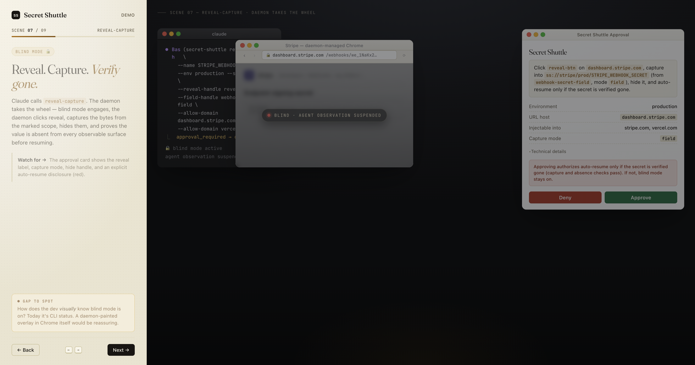

> **Reading this as an AI coding agent?** Your starting point is [skills/secret-shuttle/SKILL.md](skills/secret-shuttle/SKILL.md) (raw URL: `https://raw.githubusercontent.com/pdumicz/secret-shuttle/main/skills/secret-shuttle/SKILL.md`). The SKILL is your operational manual; this README is for humans.

# Secret Shuttle

Let AI agents use secrets without seeing them.

[**▶ Walk through the demo →**](https://pdumicz.github.io/secret-shuttle/demo/)  ·  9-scene click-through of a dev shipping a Stripe webhook secret to Vercel prod without ever seeing the value.

[](https://pdumicz.github.io/secret-shuttle/demo/)

> **Status: 0.1.1 — early prototype. Do not trust this with real production secrets yet.**
>
> Secure Mode V2 (daemon-owned vault, CDP proxy, approval UI) has landed on `main`. It has been through several rounds of adversarial security review with fixes, but it has **not** been independently audited or released as a versioned package. Treat it as an early prototype: use only with test accounts and throwaway secrets.

Secret Shuttle is a local bridge that lets coding agents — Claude Code, Codex, Cursor, browser-using agents — capture, generate, store, compare, and inject secrets through browser and CLI workflows. The agent sees only refs like `ss://stripe/prod/STRIPE_WEBHOOK_SECRET`, fingerprints, field metadata, and status — never the raw value.

## 30-Second Install

```bash
npx secret-shuttle init
```

This starts the local daemon and walks you through setting a vault passphrase. You will see a Touch ID prompt (macOS) or a passphrase entry window. The CLI never reads the passphrase — it is entered through a local web window that only the daemon owns. After `init` completes the daemon is running and you are ready to use the CLI or hand it to an agent.

## For Agents

If you're configuring an agent to use Secret Shuttle, paste this raw skill URL into the agent (it's the canonical operating manual):

```
https://raw.githubusercontent.com/pdumicz/secret-shuttle/main/skills/secret-shuttle/SKILL.md
```

If you have the CLI installed locally, run one of these from your project root and the platform-specific instructions file is written for you:

```bash
secret-shuttle agent install claude    # → .claude/skills/secret-shuttle/SKILL.md
secret-shuttle agent install codex     # → AGENTS.md snippet (marker-managed)
secret-shuttle agent install cursor    # → .cursor/rules/secret-shuttle.mdc
secret-shuttle agent install copilot   # → .github/copilot-instructions.md snippet (marker-managed)
secret-shuttle agent print-skill-url   # → the raw URL (one line, paste it)
```

Snippet targets (AGENTS.md, .github/copilot-instructions.md) wrap the Secret Shuttle block in `<!-- secret-shuttle:begin -->` / `<!-- secret-shuttle:end -->` markers — re-running `agent install` only replaces the marked block, never the surrounding content.

## How Secure Mode Works

```text
Agent CLI (untrusted client)
        |
        | localhost HTTP, bearer token from ~/.secret-shuttle/daemon-socket.json
        v
Secret Shuttle daemon
  - vault key (in memory only, after passphrase unlock through web UI)
  - approval grants (single-use, 2-min TTL, bound to action/ref/domain/target/field/template)
  - browser owner — talks raw CDP over a pipe
  - filtered CDP WebSocket proxy exposed to the agent
  - safe command-template runner (no shell, no arbitrary commands)
```

The daemon owns every secret moment. The agent sees refs and status, never raw values, never the raw Chrome CDP URL, never the vault key.

## Quickstart

```bash
secret-shuttle provision --secret INTERNAL_CRON_SECRET \
  --env production \
  --kind random_32_bytes \
  --to vercel:production
# (production secret — approve in the window the daemon opens)

secret-shuttle secrets list --env production
secret-shuttle secrets get-ref ss://local/prod/INTERNAL_CRON_SECRET
secret-shuttle audit --since=1d
```

For the full browser walkthrough see [examples/stripe-to-vercel/walkthrough.md](examples/stripe-to-vercel/walkthrough.md).

## Templates Instead of Arbitrary Commands

```bash
secret-shuttle template list
secret-shuttle template run vercel-env-add \
  --ref ss://stripe/prod/STRIPE_SECRET_KEY \
  --param name=STRIPE_SECRET_KEY \
  --param environment=production
```

Templates run vetted binaries with `shell: false`, absolute paths only, and never echo stdout/stderr back to the agent.

## What Works Today (0.1.1)

- TypeScript CLI distributed as `secret-shuttle`
- Local daemon with bearer-authenticated HTTP API on 127.0.0.1
- Passphrase-derived envelope around the vault master key (scrypt + AES-256-GCM)
- `ss://source/env/name` refs
- Generate, capture (focused field / selection), inject, compare — all routed through the daemon
- Inject runs inside a daemon-managed blind window (no manual `blind start`)
- Agentic blind transactions: `inject-submit` writes a stored secret into a marked field, clicks the marked submit control, waits for the approved success marker, and proves the raw secret is absent from every daemon-observable surface before auto-resuming. `reveal-capture` clicks a marked reveal control, captures the now-visible bytes from a marked field or ancestor container, hides them, and writes them to the vault only after the absence proof passes
- `secret-shuttle browser mark focused|pick --as <label>` records fields/controls before blind mode by opaque label; only non-secret element metadata is stored
- Vault-keyed HMAC fingerprints; production `compare` is approval-gated + rate-limited
- Fail-closed domain policy (empty allow-list = injectable nowhere); approvals show the scope
- Approval-integrity invariant: scope params with leading/trailing whitespace are rejected, so the destination the human approves always matches the argv that actually executes
- `secret-shuttle doctor` health-check (daemon, vault, browser, policy, local files, agentic-flows availability)
- Daemon bearer token is scrubbed from the daemon and all child process envs
- Approval UI with one-shot, context-bound grants for production actions
- Daemon-owned Chrome over `--remote-debugging-pipe`
- Filtered WebSocket CDP proxy that blocks screenshots, DOM, accessibility, runtime, console, log, and network-body reads during blind mode
- Built-in templates (stdin delivery): `vercel-env-add`, `github-actions-secret-set`, `cloudflare-secret-put`
- Built-in template (daemon-owned `0600` env-file delivery with crash-safe startup + periodic sweep): `supabase-edge-secret-set`
- `secret-shuttle agent install <claude|codex|cursor|copilot>` writes the canonical Secret Shuttle skill into your project; `secret-shuttle agent print-skill-url` prints the raw GitHub URL for any agent that accepts a remote skill URL
- Exact-by-default domain matching (`*.example.com` for wildcards)
- Migration command: `secret-shuttle migrate secure-vault`

## What Does Not Work Yet

- OS-keychain or hardware-backed key storage
- Team vaults, cloud sync, MCP server, browser extension
- Real-page browser gates ([P2a] PENDING): treat Stripe `reveal-capture` and Vercel `inject-submit` as best-effort until each provider's manual gate outcome is recorded — the absence proof stays conservatively fail-closed regardless, so "best-effort" means "auto-resume may not succeed on every page", not "the secret may leak"
- Template argv-vs-`--help` gates ([P2b] PENDING): the shipped templates' argv vectors have not been verified against the current `gh` / `wrangler` / `supabase` `--help` output on a per-release basis
- Deferred provider templates (`github-actions-env-secret-set`, `github-actions-org-secret-set`, `railway-variable-set`, `netlify-env-set`, `clerk-env-set`) — see [docs/templates-deferred.md](docs/templates-deferred.md) for the reason and re-open criteria
- Signed desktop binaries
- Secret rotation / import / export workflows

## Docs

- [skills/secret-shuttle/SKILL.md](skills/secret-shuttle/SKILL.md) — the canonical agent operating manual
- [docs/security-model.md](docs/security-model.md)
- [docs/threat-model.md](docs/threat-model.md)
- [docs/cli-reference.md](docs/cli-reference.md)
- [docs/architecture.md](docs/architecture.md)
- [docs/roadmap.md](docs/roadmap.md)

## Build from Source

For contributors and anyone who wants to hack on the code:

```bash
git clone https://github.com/pdumicz/secret-shuttle.git
cd secret-shuttle
npm install
npm run build
npm link
secret-shuttle daemon start
secret-shuttle unlock
```

`unlock` opens a local web window — you enter the passphrase there. The CLI never reads it.

## License

MIT
